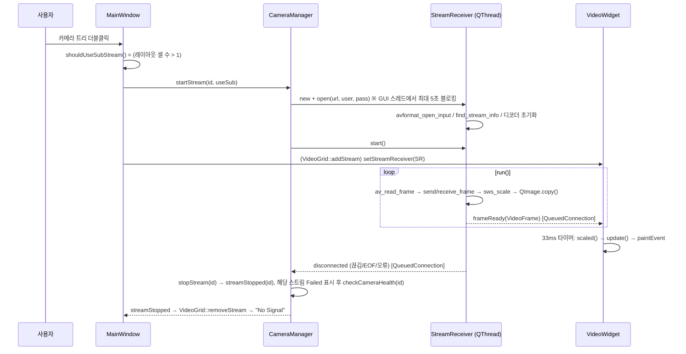
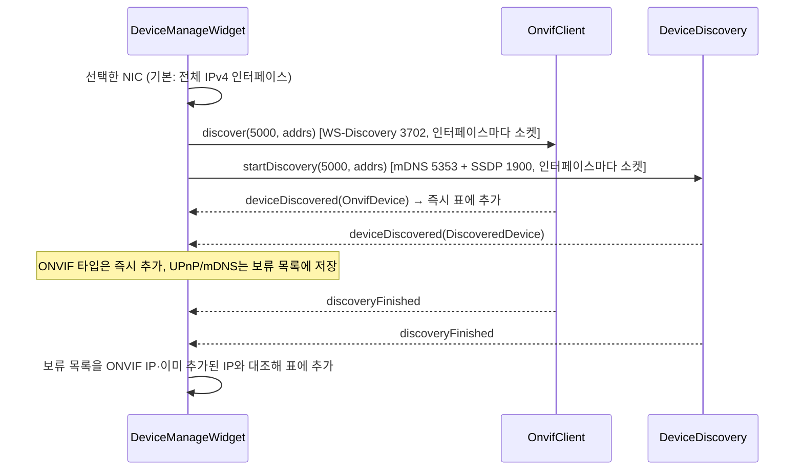

# VMS 아키텍처 (현재 코드 기준)

마지막 검토: 2026‑09‑06. 이 문서는 **현재 구현된 것**만 적는다. 목표 아키텍처는 [intelligent-vms-concept.md](intelligent-vms-concept.md) 5절을 본다.

## 개요

```
┌─────────────────────────────────────────────────────────────┐
│                        UI Layer  (src/ui)                    │
│  MainWindow · VideoGrid · VideoWidget · CameraTree            │
│  DeviceManageWidget · AddCameraDialog · NetworkSettingsDialog │
│  PlaybackView · TimelineWidget                                │
├─────────────────────────────────────────────────────────────┤
│                       Core Layer  (src/core)                 │
│  CameraManager · StreamReceiver · OnvifClient                 │
│  DeviceDiscovery · PlaybackController                         │
├─────────────────────────────────────────────────────────────┤
│                     Utils Layer  (src/utils)                 │
│  Database (SQLite)                                            │
├─────────────────────────────────────────────────────────────┤
│           Qt6 (Widgets, Network, Sql) · FFmpeg 8              │
└─────────────────────────────────────────────────────────────┘
```

## 클래스와 구현 상태

### UI Layer

| 클래스 | 역할 | 상태 |
|--------|------|------|
| `MainWindow` | 헤더 탭(Main View / Device Manage / Playback / Record Schedule / Sys. Settings), 좌측 카메라 트리, 중앙 `QStackedWidget`, 하단 레이아웃 버튼. `CameraManager`와 `OnvifClient`를 `unique_ptr`로 소유 | 구현. Record Schedule, Sys. Settings 탭은 플레이스홀더 |
| `VideoGrid` | 1×1, 2×2, 1+7, 3×3, 4×4 레이아웃. 더블클릭 최대화 토글. F2로 통계 오버레이 | 구현 |
| `VideoWidget` | 스트림 1개 표시. `frameReady`를 큐드 커넥션으로 받아 33ms 타이머로 스케일·그리기 | 구현 |
| `CameraTree` | 카메라 목록, 30초마다 TCP 핑으로 온라인 아이콘(도달 가능 여부), 우클릭 메뉴(Start/Stop은 실제 스트리밍 여부, Edit/Delete). Start와 Edit는 시그널로 `MainWindow`에 위임 | 구현 |
| `DeviceManageWidget` | 검색된 장치 표 + 추가된 장치 표. ONVIF/mDNS/SSDP 검색 결과 병합, 추가/수정/삭제, IP 변경 | 구현 |
| `AddCameraDialog` | ONVIF: GetServices→(폴백 GetCapabilities)→GetDeviceInformation→GetProfiles→GetStreamUri(메인/서브). RTSP: URL 직접 입력. 미리보기 | 구현 |
| `NetworkSettingsDialog` | ONVIF GetNetworkInterfaces / SetNetworkInterfaces / SetNetworkDefaultGateway / SystemReboot | 구현 |
| `PlaybackView` | 파일 열기 → 재생/일시정지/정지/속도/탐색. 타임라인 위젯 | 구현 (파일 직접 열기만) |
| `TimelineWidget` | 구간 표시, 휠 줌, 클릭 탐색 | 구현 (데이터 연결 없음) |
| `PtzControl` | PTZ 방향 패드 | 컴파일만 됨. `MainWindow`에 배치되지 않음 |

### Core Layer

| 클래스 | 역할 | 상태 |
|--------|------|------|
| `CameraInfo` (`camera.h`) | 카메라 데이터 구조. 메인/서브 RTSP URL, ONVIF 경로, 기본 URL 추측 로직 | 구현 |
| `CameraManager` | 카메라 CRUD + DB 동기화. 카메라별 `StreamReceiver` 1개 소유. 메인/서브 전환(`restartStream`) | 구현 |
| `StreamReceiver` | `QThread`. `open()`에서 `avformat_open_input`(호출 스레드에서 최대 5초 블로킹), `run()`에서 read→decode→`sws_scale`→RGB32 `QImage`→`frameReady` emit. `stop()`은 FFmpeg interrupt callback으로 블로킹을 끊고 스레드 종료를 기다린다. 통계 | 구현 |
| `OnvifClient` | WS‑Discovery(인터페이스마다 소켓, 프로브 2회, IP 기준 중복 제거), SOAP 직접 생성(WS‑Security UsernameToken 다이제스트), GetServices/GetCapabilities/GetDeviceInformation/GetProfiles/GetStreamUri/PTZ ContinuousMove·Stop/네트워크 설정. 단일 `QNetworkAccessManager`, 500/503 재시도 | 구현. 인스턴스 1개를 여러 위젯이 공유 |
| `DeviceDiscovery` | mDNS(5353), SSDP(1900) 검색. 인터페이스마다 소켓을 만들어 각각 질의하고 0.9초마다 재전송. 휴리스틱으로 카메라 여부 판단 | 구현. WS‑Discovery는 `OnvifClient`가 담당 |
| `local_interfaces` (함수) | 검색에 쓸 IPv4 인터페이스 열거, 인터페이스 주소 바인드 + 멀티캐스트 송신 인터페이스 지정 | 구현. `OnvifClient`, `DeviceDiscovery`, `DeviceManageWidget`이 공용 |
| `PlaybackController` | 파일 열기, 타이머 기반 GUI 스레드 디코드, seek, 속도 | 구현 |
| `Recorder` | FFmpeg muxer로 패킷 기록 | 컴파일만 됨. 호출 없음 |
| `VideoDecoder` | 독립 디코더 | 컴파일만 됨. 호출 없음 |

### Utils Layer

| 클래스 | 역할 | 상태 |
|--------|------|------|
| `Database` | SQLite 래퍼. `cameras`, `recordings` 테이블, 시작 시 `ALTER TABLE` 마이그레이션 | 구현. `recordings`는 쓰는 곳 없음 |

## 소유 관계

```
main() ─ MainWindow
          ├─ unique_ptr<CameraManager> ─ unique_ptr<Database>
          │                           └─ QHash<id, StreamReceiver*>   (카메라당 1개, 소유. deleteLater 로 삭제)
          ├─ unique_ptr<OnvifClient>
          └─ QObject 자식 위젯들
               ├─ CameraTree        ── CameraManager* (raw)
               ├─ VideoGrid ── VideoWidget[] ── QPointer<StreamReceiver> (CameraManager 소유, 삭제되면 null)
               ├─ DeviceManageWidget ── CameraManager*, OnvifClient*, DeviceDiscovery(자식)
               └─ PlaybackView ── unique_ptr<PlaybackController>
```

UI 위젯은 리시버를 소유하지 않고 `CameraManager::getStreamReceiver(id)`로 얻어 `QPointer`로 참조하며 시그널만 연결한다. `CameraManager`는 리시버를 `deleteLater`로 지우면서 `streamStopped`를 내보내고, `MainWindow`가 이를 받아 그리드 슬롯을 비운다(메인/서브 전환 중에는 슬롯을 유지하고 새 리시버로 교체). 워커 스레드가 끊김(`disconnected`)을 알리면 `CameraManager`가 같은 경로로 정리한다.

## 데이터 흐름

### 라이브 스트리밍



레이아웃이 1×1↔다중으로 바뀌면 `MainWindow::updateStreamsForLayout()`이 실행 중인 모든 카메라를 `restartStream`으로 메인/서브 URL로 재접속한다.

### 장치 검색 (Device Manage 탭)



### ONVIF 카메라 추가 (AddCameraDialog)

```
Test Connection
  → setCredentials → GetServices
    → media URL 없으면 GetCapabilities
      → 그래도 없으면 device_service URL을 media URL로 사용
  → (300ms 후) GetDeviceInformation → 모델/시리얼/제조사 표시
  → (800ms 후) GetProfiles → 해상도순 정렬, 메인=최고, 서브=최저
  → (500ms, 1500ms 후) GetStreamUri ×2 → 메인/서브 URL 표시
  → 메인 URL로 미리보기 StreamReceiver 시작
OK → CameraInfo 반환 → CameraManager::addCamera → DB 저장
```

지연(`QTimer::singleShot`)은 일부 카메라가 연속 SOAP 요청에 503을 반환하는 문제를 피하기 위한 것이다.

## 스레딩 모델

```
Main Thread (Qt Event Loop)
  - 모든 UI, 시그널/슬롯, 그리기
  - StreamReceiver::open()  ← 네트워크 블로킹 (timeout 5초, interrupt callback 으로 중단 가능. known-issues R1)
  - PlaybackController 디코드 (타이머)
  - OnvifClient / DeviceDiscovery (비동기 소켓, 블로킹 없음)

StreamReceiver::run()  ×N (카메라당 1개)
  - av_read_frame → 디코드 → 색변환 → frameReady emit
  - avcodec thread_count = 720p 초과 4, 이하 2 (FRAME|SLICE)

QThreadPool (global)
  - CameraTree::CameraStatusChecker: 30초마다 카메라당 TCP connect 1회
```

### 스레드 간 데이터

- `VideoFrame`(QImage 복사본), `StreamStats`는 값으로 큐드 커넥션을 통해 전달. `qRegisterMetaType` 없이 Qt 6 moc 자동 등록에 의존.
- `StreamReceiver::m_mutex`는 `open/close`와 `run()`의 읽기·디코드 구간을 함께 잠근다. `stop()`이 `m_abortRequested`를 세우면 FFmpeg interrupt callback이 블로킹 읽기를 즉시 끝내므로 `close()`는 오래 기다리지 않는다. `QThread::terminate()`는 쓰지 않는다.
- `VideoWidget::m_frameMutex`는 실제로는 GUI 스레드 안에서만 쓰인다(수신 슬롯이 큐드라 GUI 스레드에서 실행).

## 영속화

| 대상 | 위치 |
|------|------|
| 카메라 정보 (비밀번호 평문) | `%APPDATA%/VMS/VMS/vms.db` (`QStandardPaths::AppDataLocation`) |
| 윈도우 geometry, 마지막 그리드 레이아웃 | `QSettings("VMS","VMS")` → 레지스트리 `HKCU\Software\VMS\VMS` |
| 디버그 로그 | `%APPDATA%/VMS/VMS/vms_debug.log` (stderr에도 출력, 뮤텍스로 직렬화) |

## 의존성

```
VMS.exe
├── Qt6::Widgets, Qt6::Network, Qt6::Sql
├── libavformat, libavcodec, libavutil, libswscale, libswresample
└── ws2_32
```

## rapidvms와의 비교

| 항목 | rapidvms | 본 프로젝트 |
|------|----------|-------------|
| Qt | 5.x | 6.x |
| 빌드 | VS Solution / Makefile | CMake |
| ONVIF | gSOAP | Qt Network로 직접 구현 |
| 렌더링 | D3D / SDL2 | QPainter / QImage |
| 저장소 | LevelDB | SQLite |
| 구조 | Client‑Server | 단독 실행형 |
