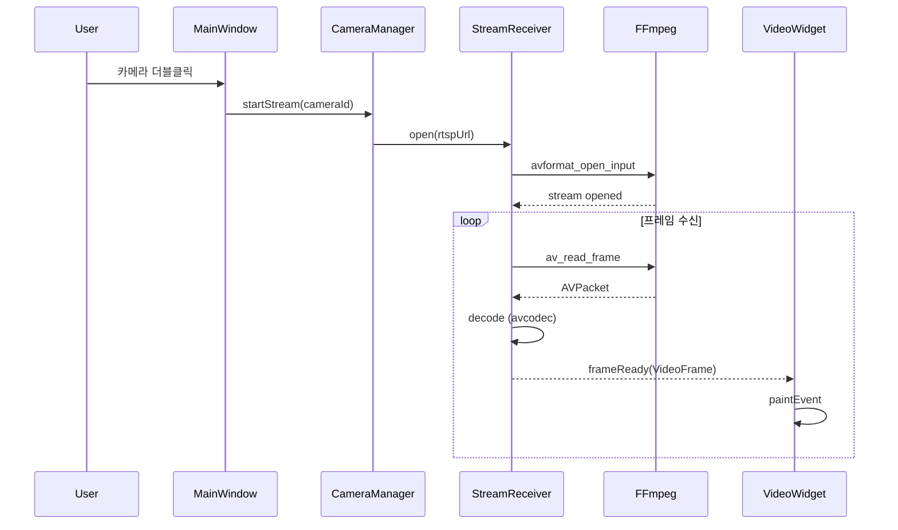
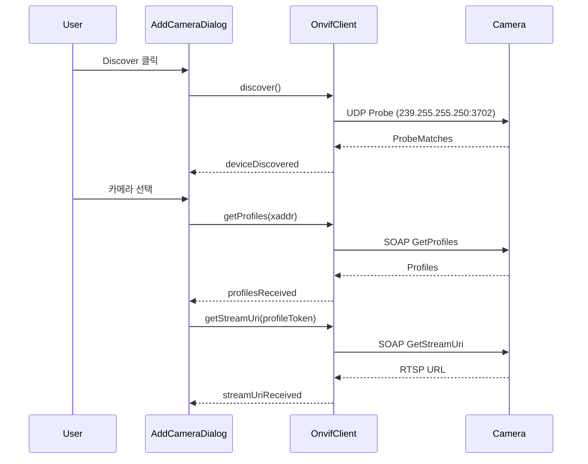
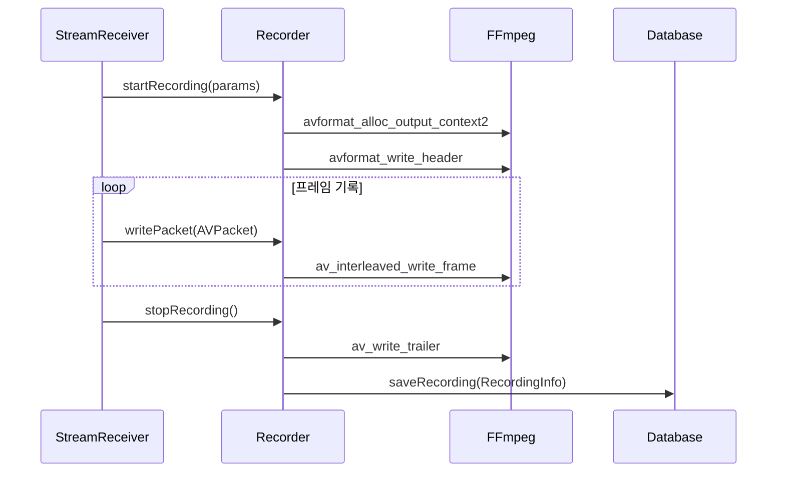
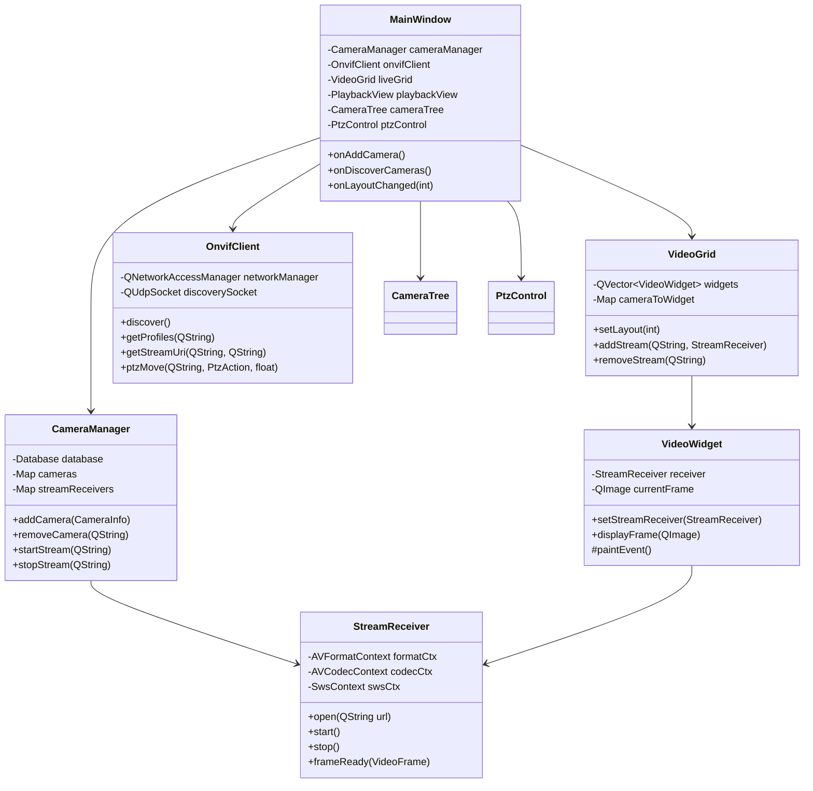

# VMS 아키텍처

## 개요

VMS는 3개의 레이어로 구성된 클린 아키텍처를 따릅니다.

```
┌─────────────────────────────────────────────────────────────┐
│                        UI Layer                              │
│  (MainWindow, VideoWidget, VideoGrid, CameraTree, etc.)     │
├─────────────────────────────────────────────────────────────┤
│                       Core Layer                             │
│  (CameraManager, StreamReceiver, Recorder, OnvifClient)     │
├─────────────────────────────────────────────────────────────┤
│                    External Libraries                        │
│           (Qt6, FFmpeg, SQLite, Network)                    │
└─────────────────────────────────────────────────────────────┘
```

## 레이어 설명

### 1. UI Layer (`src/ui/`)

사용자 인터페이스를 담당합니다.

| 클래스 | 역할 |
|--------|------|
| `MainWindow` | 메인 윈도우, 전체 레이아웃 관리 |
| `VideoWidget` | 단일 비디오 스트림 표시 |
| `VideoGrid` | 다중 비디오 그리드 레이아웃 (1x1, 2x2, 3x3, 4x4) |
| `CameraTree` | 카메라 목록 트리뷰 |
| `PlaybackView` | 녹화 영상 재생 화면 |
| `TimelineWidget` | 타임라인 컨트롤 |
| `PtzControl` | PTZ 방향 제어 패널 |
| `AddCameraDialog` | 카메라 추가 대화상자 |

### 2. Core Layer (`src/core/`)

비즈니스 로직과 미디어 처리를 담당합니다.

| 클래스 | 역할 |
|--------|------|
| `Camera` | 카메라 정보 데이터 구조 |
| `CameraManager` | 카메라 CRUD, 스트림 관리 |
| `StreamReceiver` | RTSP 스트림 수신 및 디코딩 (FFmpeg) |
| `VideoDecoder` | 비디오 프레임 디코딩 |
| `Recorder` | 비디오 녹화 (FFmpeg muxer) |
| `OnvifClient` | ONVIF 프로토콜 클라이언트 |
| `PlaybackController` | 녹화 파일 재생 제어 |

### 3. Utils Layer (`src/utils/`)

유틸리티 및 데이터 접근을 담당합니다.

| 클래스 | 역할 |
|--------|------|
| `Database` | SQLite 데이터베이스 래퍼 |

## 데이터 흐름

### 라이브 스트리밍



### ONVIF 카메라 검색



### 녹화 흐름



## 클래스 다이어그램



## 스레딩 모델

```
┌──────────────────────────────────────────────────────────────┐
│                      Main Thread (Qt Event Loop)             │
│  - UI 이벤트 처리                                              │
│  - 시그널/슬롯 처리                                            │
│  - 화면 렌더링                                                 │
└──────────────────────────────────────────────────────────────┘
        │                    │                    │
        ▼                    ▼                    ▼
┌──────────────┐    ┌──────────────┐    ┌──────────────┐
│ StreamThread │    │ StreamThread │    │  Recorder    │
│  (Camera 1)  │    │  (Camera 2)  │    │   Thread     │
│              │    │              │    │              │
│ - RTSP 수신   │    │ - RTSP 수신   │    │ - 파일 쓰기   │
│ - 디코딩      │    │ - 디코딩      │    │              │
└──────────────┘    └──────────────┘    └──────────────┘
```

### 스레드 안전성

- `StreamReceiver`는 별도 스레드에서 실행
- `QMutex`를 사용하여 프레임 버퍼 보호
- Qt의 `Qt::QueuedConnection`으로 스레드간 시그널 전달
- 프레임 복사본 전달로 데이터 경쟁 방지

## 의존성 그래프

```
VMS.exe
├── Qt6::Widgets
├── Qt6::OpenGLWidgets
├── Qt6::Network
├── Qt6::Sql
├── Qt6::Concurrent
├── libavcodec (FFmpeg)
├── libavformat (FFmpeg)
├── libavutil (FFmpeg)
├── libswscale (FFmpeg)
├── libswresample (FFmpeg)
└── ws2_32 (Windows Socket)
```

## rapidvms와의 비교

| 항목 | rapidvms | 본 프로젝트 |
|------|----------|------------|
| Qt 버전 | Qt 5.x | Qt 6.x |
| 빌드 시스템 | VS Solution / Makefile | CMake |
| ONVIF | gSOAP 기반 | 직접 구현 (Qt Network) |
| 렌더링 | D3D / SDL2 | QPainter / QImage |
| 저장소 | LevelDB | SQLite |
| 아키텍처 | Client-Server | 단독 실행형 |
