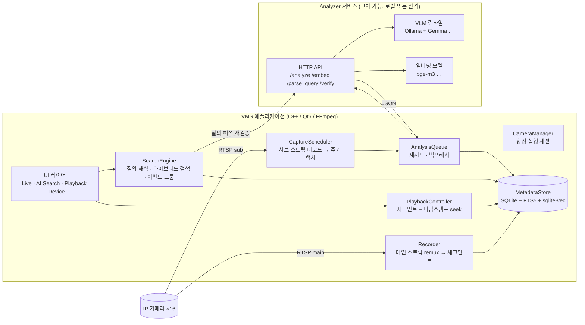
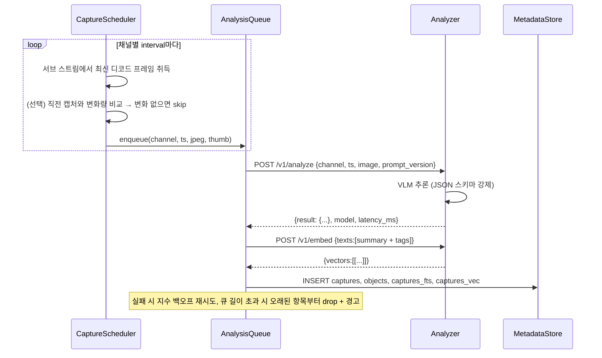
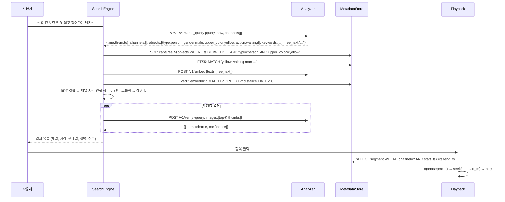

# 지능형 VMS: 제품 개념 및 설계

작성일: 2026‑09‑06 · 상태: 초안(v0.1) · 관련 문서: [intelligent-vms-research.md](intelligent-vms-research.md)

## 1. 한 줄 정의

> 16채널 IP 카메라를 관리·녹화·재생하는 VMS에, **로컬 VLM(Vision‑Language Model)이 영상을 주기적으로 읽어 메타데이터로 남기고, 사용자가 자연어로 과거 영상을 검색해 바로 재생하는** 기능을 주기능으로 얹은 제품.

예: 사용자가 `"1일 전 노란색 옷 입고 걸어가는 남자 찾아줘"`라고 입력하면, 시스템은 메타데이터를 검색해 **채널 + 타임스탬프 + 썸네일 + 설명** 목록을 보여주고, 항목을 클릭하면 해당 시각의 녹화 영상이 재생된다.

## 2. 배경과 목표

### 2.1 왜 만드는가

- 기존 VMS는 "언제 어디서 무슨 일이 있었는지"를 사람이 타임라인을 돌려 가며 찾는다. 16채널 하루치를 사람이 훑는 것은 사실상 불가능하다.
- 모션 감지나 객체 검출(YOLO 등) 기반 검색은 "사람", "차량" 수준의 분류만 가능하고 "노란 옷", "가방을 멘", "뛰어가는" 같은 서술을 다루지 못한다.
- 2025~2026년 사이 로컬에서 구동 가능한 VLM(Gemma 3/4, Qwen‑VL 등)의 품질과 속도가 실용 수준에 도달했고, Ollama 같은 런타임이 JSON 스키마 강제 출력을 지원한다. 소비자용 GPU 한 장으로 16채널 규모의 주기 분석이 가능해졌다.

### 2.2 제품 목표

| 목표 | 설명 |
|------|------|
| **의미 검색이 주기능** | 자연어 질의로 과거 영상을 찾고 바로 재생. 이 흐름이 제품의 첫 화면이자 핵심 가치 |
| **기존 VMS 기능 유지** | 라이브 뷰, ONVIF 검색/추가, PTZ, 녹화, 재생, 장치 관리는 그대로 필요 |
| **엔진 독립** | VLM/임베딩 엔진은 교체 가능해야 한다. 1차는 Ollama + Gemma로 시작하되 인터페이스로 분리 |
| **분석 위치 독립** | 분석 서비스는 같은 PC에서도, 별도 GPU 서버에서도 돌 수 있어야 한다 |
| **16채널 / 1대** | 제품 한 대가 16채널을 커버. 채널당 캡처 간격은 설정 가능 |
| **로컬 완결** | 영상과 메타데이터는 외부로 나가지 않는다. 인터넷 없이 동작 |

### 2.3 범위 밖 (1차)

- 실시간 알람(예: "밤에 사람이 들어오면 알림") → 2차 이후
- 얼굴 인식, 신원 식별 → 하지 않는다 (법적·윤리적 부담, 아래 6.4 참고)
- 여러 대의 지능형 VMS를 묶는 중앙 관리 → 이후 단계
- 클라우드 연동

## 3. 사용자 시나리오

### 시나리오 A. 사후 검색 (핵심)

1. 경비 담당자가 "어제 오후에 주차장에서 흰색 SUV 옆에 서 있던 사람"을 찾아야 한다.
2. AI 검색 탭에 `어제 오후 주차장에서 흰색 SUV 옆에 서 있는 사람`을 입력한다.
3. 시스템이 질의를 해석한다: 시간 = 어제 12:00~18:00, 채널 = 이름에 "주차장"이 포함된 채널, 객체 = 사람 + 차량(흰색, SUV), 관계/행동 = 서 있음.
4. 결과 목록: 채널 3, 15:42:10, 썸네일, "흰색 SUV 옆에 검은 상의를 입은 남성이 서 있음" (유사도 0.87) … 12건.
5. 항목을 클릭하면 재생 탭으로 전환되고 채널 3의 15:42:00부터 재생된다. 타임라인에는 같은 질의의 다른 매치가 마커로 표시된다.

### 시나리오 B. 채널 요약

1. "오늘 채널 5에서 무슨 일이 있었어?"
2. 시스템이 채널 5의 오늘 메타데이터를 시간순으로 묶어(이벤트 그룹) 요약을 보여준다: "08:10 청소 차량 진입, 09:30~11:00 사람 왕래 많음, 14:20 자전거 한 대 방치…"
3. 각 항목 클릭 → 재생.

### 시나리오 C. 카메라 관리 (기존 VMS)

1. 장치 관리 탭에서 ONVIF 검색 → 카메라 추가 → 프로필 선택 → 메인/서브 스트림 URL 확인.
2. 채널 설정에서 "AI 분석 사용", "캡처 간격 30초", "야간 분석 사용" 등을 지정.
3. 라이브 뷰에서 1×1 / 2×2 / 1+7 / 3×3 / 4×4 레이아웃으로 모니터링.

## 4. 요구사항

### 4.1 기능 요구사항

| ID | 요구사항 | 우선순위 |
|----|----------|----------|
| F‑01 | 채널별로 설정한 간격(기본 30초)마다 프레임을 캡처해 Analyzer로 보낸다 | 필수 |
| F‑02 | Analyzer는 프레임을 VLM으로 분석해 **고정 스키마 JSON**을 반환한다 | 필수 |
| F‑03 | 분석 결과, 썸네일, 텍스트 임베딩을 로컬 DB에 저장한다 | 필수 |
| F‑04 | 자연어 질의(한국어/영어)를 시간·채널·객체·속성·행동 필터로 해석한다 | 필수 |
| F‑05 | 구조화 필터 + 키워드 + 벡터 유사도를 결합한 하이브리드 검색으로 후보를 찾는다 | 필수 |
| F‑06 | 연속된 매치를 이벤트로 묶어 채널·시각·썸네일·설명 목록으로 보여준다 | 필수 |
| F‑07 | 결과를 클릭하면 해당 채널의 해당 시각 녹화를 재생한다 | 필수 |
| F‑08 | 16채널 연속 녹화(메인 스트림)와 세그먼트 인덱스를 유지한다 | 필수 (선행) |
| F‑09 | 채널별 분석 on/off, 간격, 관심 영역, 야간 처리 옵션 | 필수 |
| F‑10 | Analyzer의 위치(로컬/원격 URL), 모델, 프롬프트 버전을 설정한다 | 필수 |
| F‑11 | 결과 상위 N건을 VLM으로 재검증해 정밀도를 높이는 옵션 | 권장 |
| F‑12 | 채널 일일 요약 생성 | 권장 |
| F‑13 | 규칙 기반 알람 (메타데이터 조건 만족 시 알림) | 2차 |
| F‑14 | 라이브 뷰, ONVIF 검색/추가, PTZ, 장치 관리, 네트워크 설정 (기존 기능) | 필수 |

### 4.2 비기능 요구사항

| ID | 요구사항 | 목표치 |
|----|----------|--------|
| N‑01 | 채널 수 | 16채널 / 1대 |
| N‑02 | 분석 처리량 | 16채널 × 30초 간격을 GPU 1장으로 지연 누적 없이 처리 (약 0.5 img/s) |
| N‑03 | 검색 응답 | 30일치 메타데이터에서 후보 검색 2초 이내, 재검증 포함 10초 이내 |
| N‑04 | 보존 | 메타데이터·썸네일 90일, 녹화 30일 (설정 가능) |
| N‑05 | 장애 격리 | Analyzer가 죽어도 라이브/녹화는 계속. 분석 큐는 재시작 후 이어서 처리 |
| N‑06 | 엔진 교체 | Analyzer 구현을 바꿔도 VMS 코드는 수정 없이 동작 (인터페이스 계약 고정) |
| N‑07 | 프라이버시 | 영상·메타데이터 외부 전송 없음. 신원 식별 속성 미생성 |

## 5. 목표 아키텍처

### 5.1 컴포넌트



### 5.2 설계 원칙

1. **녹화는 디코드하지 않는다.** 메인 스트림 패킷을 그대로 컨테이너에 remux한다. 16채널 1080p를 CPU로 상시 디코드하는 비용을 피한다.
2. **분석은 서브 스트림에서 한다.** VLM 입력은 어차피 896px 내외로 축소되므로 640×360~1280×720 서브 스트림이면 충분하다. 서브 스트림은 상시 디코드하거나, 캡처 시각 부근의 키프레임만 디코드한다.
3. **UI가 열려 있지 않아도 세션은 돈다.** 현재 코드는 사용자가 그리드에 띄운 채널만 스트림을 연다. 분석과 녹화는 UI와 무관하게 채널 설정에 따라 항상 실행되어야 한다.
4. **Analyzer는 프로세스 경계 밖에 둔다.** HTTP 계약만 고정하면 엔진(Ollama, vLLM, llama.cpp, 클라우드 API)과 위치(로컬, 원격)를 자유롭게 바꿀 수 있다.
5. **메타데이터는 스키마 버전과 프롬프트 버전을 함께 저장한다.** 모델이나 프롬프트를 바꾸면 결과 분포가 달라진다. 재처리 대상 판별과 검색 품질 비교에 필요하다.
6. **검색은 세 단계다.** 싸고 정확한 필터(시간·채널·enum) → 넓은 후보(키워드+벡터) → 비싼 재검증(VLM). 대부분의 질의는 두 번째 단계에서 끝난다.

### 5.3 분석 파이프라인



### 5.4 검색 파이프라인



## 6. 데이터 설계

### 6.1 분석 결과 JSON (schema_version 1)

Analyzer가 반환하고 DB `captures.json`에 그대로 저장되는 문서. **속성값은 enum 어휘를 쓰고, 자유 서술은 `summary` 하나로 제한**한다. 어휘를 고정해야 SQL 필터가 가능하고 모델 교체 시에도 호환된다. 객체마다 **절대 픽셀 좌표 `bbox`**를 갖고, 그 기준 해상도는 최상위 `frame`에 적는다(좌표 규칙은 아래 참고).

```json
{
  "schema_version": 1,
  "channel_id": "cam-03",
  "captured_at": "2026-09-05T14:32:10+09:00",
  "frame": { "width": 1280, "height": 720 },
  "scene": {
    "summary": "A man in a yellow t-shirt and black pants walks left to right across a parking lot; a white sedan is parked in the top-left.",
    "location_type": "parking_lot",
    "lighting": "day",
    "weather": "clear",
    "crowd_level": "low"
  },
  "objects": [
    {
      "type": "person",
      "count": 1,
      "attributes": {
        "gender": "male",
        "age_group": "adult",
        "upper_color": "yellow",
        "upper_type": "t-shirt",
        "lower_color": "black",
        "lower_type": "pants",
        "accessories": ["backpack"]
      },
      "action": "walking",
      "direction": "left_to_right",
      "region": "center",
      "bbox": { "x": 592, "y": 236, "w": 96, "h": 268 }
    },
    {
      "type": "vehicle",
      "count": 1,
      "attributes": { "vehicle_type": "sedan", "color": "white" },
      "action": "parked",
      "region": "top_left",
      "bbox": { "x": 48, "y": 64, "w": 312, "h": 150 }
    }
  ],
  "events": ["person_passing"],
  "tags": ["person", "male", "yellow", "walking", "backpack", "vehicle", "white", "sedan", "parked"],
  "anomaly": { "flag": false, "reason": "" },
  "model": { "name": "gemma4:12b", "prompt_version": "v1.0", "latency_ms": 3400 }
}
```

좌표 규칙:

- `bbox`는 `{x, y, w, h}` 정수이며 **`frame.width × frame.height` 픽셀 기준 절대좌표**다. 원점은 좌상단, x는 오른쪽, y는 아래로 증가한다. 정규화 좌표(0~1, 0~1000)는 계약에 두지 않는다.
- `frame`은 Analyzer에 보낸 이미지(`image_b64`)의 크기, 즉 캡처 원본(서브 스트림 해상도)이다. VLM이 내부적으로 896px로 축소하거나 정규화 좌표(Gemma 계열은 0~1000)로 출력하더라도 **Analyzer가 이 픽셀 공간으로 환산해서 돌려준다.** VMS는 변환하지 않는다.
- 다른 해상도에 그릴 때(메인 스트림 재생 화면, 320px 썸네일)는 `대상폭 / frame.width`, `대상높이 / frame.height` 비율로 스케일한다. 그래서 `frame`은 필수 필드다.
- `count > 1`이면 `bbox`는 그 객체들을 모두 감싸는 합집합 사각형이다. 개별 위치가 필요하면 객체를 따로 나열한다.
- 모델이 위치를 잡지 못하면 `bbox`는 `null`이다. 이 경우에도 `region`은 채운다.
- `region`은 저장 전에 VMS가 `bbox` 중심점을 3×3 격자에 대응시켜 다시 계산해 덮어쓴다. `bbox`가 `null`일 때만 모델 값을 쓴다. 모델·프롬프트가 바뀌어도 `region` 필터가 일관되게 동작하도록 하기 위함이다.
- VLM의 `bbox`는 전용 검출기보다 느슨하다. 용도는 검색 결과 썸네일·재생 화면의 오버레이, 채널별 관심 영역(ROI) 필터, `verify` 단계의 크롭이며 픽셀 정밀 계측용이 아니다.

enum 어휘(초안):

| 필드 | 값 |
|------|----|
| `objects[].type` | person, vehicle, bicycle, motorcycle, animal, bag, package, other |
| `attributes.upper_color` / `lower_color` / `vehicle color` | black, white, gray, red, orange, yellow, green, blue, purple, pink, brown, beige, multicolor, unknown |
| `attributes.gender` | male, female, unknown |
| `attributes.age_group` | child, teen, adult, senior, unknown |
| `attributes.vehicle_type` | sedan, suv, van, truck, bus, pickup, other |
| `action` | standing, walking, running, sitting, lying, carrying, loitering, entering, exiting, parked, moving, stopped, unknown |
| `direction` | left_to_right, right_to_left, toward_camera, away_from_camera, none |
| `region` | top_left, top, top_right, left, center, right, bottom_left, bottom, bottom_right (VMS가 `bbox` 중심으로 재계산) |
| `scene.lighting` | day, night, low_light, ir |
| `scene.crowd_level` | none, low, medium, high |

내부 표현은 영어로 통일한다. VLM은 영어 지시·출력에서 가장 안정적이고, 한국어 질의는 `parse_query` 단계에서 enum으로 정규화한다. `summary`는 다국어 임베딩(bge‑m3 등)으로 검색되므로 한국어 질의로도 매칭된다.

### 6.2 SQLite 테이블

기존 `vms.db`를 확장한다.

```sql
-- 녹화 세그먼트 인덱스 (재생의 기준)
CREATE TABLE recording_segments (
    id          TEXT PRIMARY KEY,
    channel_id  TEXT NOT NULL,
    start_ts    INTEGER NOT NULL,   -- epoch ms
    end_ts      INTEGER,
    file_path   TEXT NOT NULL,
    file_size   INTEGER DEFAULT 0,
    codec       TEXT
);
CREATE INDEX idx_seg_channel_time ON recording_segments(channel_id, start_ts);

-- 캡처 한 장 = 분석 한 건
CREATE TABLE captures (
    id              TEXT PRIMARY KEY,
    channel_id      TEXT NOT NULL,
    ts              INTEGER NOT NULL,   -- epoch ms
    frame_w         INTEGER NOT NULL,   -- 분석 이미지 크기 (bbox 기준)
    frame_h         INTEGER NOT NULL,
    thumb_path      TEXT NOT NULL,      -- 320px JPEG
    summary         TEXT,
    location_type   TEXT, lighting TEXT, crowd_level TEXT,
    anomaly         INTEGER DEFAULT 0,
    json            TEXT NOT NULL,      -- 원본 결과 전체
    schema_version  INTEGER NOT NULL,
    model           TEXT, prompt_version TEXT, latency_ms INTEGER,
    status          TEXT DEFAULT 'done' -- queued | done | failed
);
CREATE INDEX idx_cap_channel_time ON captures(channel_id, ts);

-- 객체 단위로 펼친 테이블 (SQL 필터용)
CREATE TABLE objects (
    id           INTEGER PRIMARY KEY,
    capture_id   TEXT NOT NULL REFERENCES captures(id) ON DELETE CASCADE,
    type         TEXT NOT NULL,
    count        INTEGER DEFAULT 1,
    action       TEXT, direction TEXT, region TEXT,
    bbox_x       INTEGER, bbox_y INTEGER, bbox_w INTEGER, bbox_h INTEGER,  -- frame_w×frame_h 픽셀, NULL 가능
    gender       TEXT, age_group TEXT,
    upper_color  TEXT, upper_type TEXT, lower_color TEXT, lower_type TEXT,
    vehicle_type TEXT, color TEXT,
    attrs_json   TEXT
);
CREATE INDEX idx_obj_type_color ON objects(type, upper_color, color);

-- 키워드 검색
CREATE VIRTUAL TABLE captures_fts USING fts5(summary, tags, content='captures', content_rowid='rowid');

-- 벡터 검색 (sqlite-vec)
CREATE VIRTUAL TABLE captures_vec USING vec0(capture_rowid INTEGER PRIMARY KEY, embedding float[1024]);

-- 검색 결과 그룹 (선택: 캐시)
CREATE TABLE events (
    id TEXT PRIMARY KEY, channel_id TEXT, start_ts INTEGER, end_ts INTEGER,
    summary TEXT, representative_capture_id TEXT
);
```

### 6.3 저장 위치

```
%APPDATA%/VMS/VMS/
├── vms.db                 # 카메라, 세그먼트 인덱스, 메타데이터
├── thumbs/<channel>/<yyyymmdd>/<ts>.jpg
└── (설정한 녹화 경로)/<channel>/<yyyymmdd>/<hhmmss>.mkv
```

### 6.4 프라이버시 원칙

- 얼굴 특징, 차량 번호판 문자, 이름 등 **개인을 특정할 수 있는 속성은 스키마에 두지 않는다.** 프롬프트에서도 생성을 금지한다.
- 메타데이터와 썸네일은 녹화와 같은 보존 정책을 따르고, 삭제 시 함께 지운다.
- 원격 Analyzer를 쓸 때는 사설망 또는 TLS를 전제로 한다.

## 7. Analyzer 인터페이스 계약 (v1)

VMS와 Analyzer 사이의 유일한 접점. 엔진과 위치를 바꿔도 이 계약은 유지된다. 모든 응답은 `application/json`.

| 메서드 | 경로 | 역할 |
|--------|------|------|
| GET | `/v1/health` | `{status, models:{vlm, embed, llm}, gpu:{name, vram_total, vram_used}, queue_depth}` |
| POST | `/v1/analyze` | 프레임 1장 분석. 요청 `{channel_id, ts, image_b64, schema_version, prompt_version, hints:{channel_name, location_type?}}` → 응답 6.1 JSON |
| POST | `/v1/embed` | `{texts:[…]}` → `{model, dim, vectors:[[…]]}` |
| POST | `/v1/parse_query` | `{query, now, tz, channels:[{id,name}]}` → `{time:{from,to}, channel_ids:[], objects:[{type, attributes, action}], keywords:[], free_text, confidence}` |
| POST | `/v1/verify` | `{query, items:[{id, image_b64, summary, bboxes?:[{x,y,w,h}]}]}` → `{results:[{id, match, confidence, reason}]}` |

규칙:

- `analyze`는 idempotent. 같은 `(channel_id, ts)`를 다시 보내면 다시 계산해도 된다.
- `analyze` 응답의 `frame`은 요청 `image_b64`의 실제 크기와 같아야 하고, 모든 `bbox`는 그 픽셀 공간이다. Analyzer가 추론 전에 리사이즈했다면 좌표를 원본 크기로 되돌려서 반환한다. VMS는 `frame`이 보낸 이미지와 다르면 검증 실패로 처리한다.
- 타임아웃은 VMS 쪽에서 관리한다(기본 30초). 429/503은 백오프 후 재시도.
- 스키마 검증은 **양쪽**에서 한다. Analyzer가 스키마를 강제해도 VMS는 저장 전에 재검증하고, 실패하면 `status='failed'`로 기록한다.
- 1차 구현은 Python(FastAPI) + Ollama 클라이언트로 한다. 이유는 [research 문서](intelligent-vms-research.md) 11절 참고.

## 8. UI 설계

헤더 탭 구성(현재 5개)을 다음과 같이 바꾼다.

| 탭 | 내용 |
|----|------|
| **AI Search** (기본 탭) | 검색창 + 빠른 필터(기간, 채널) + 결과 목록(썸네일, 채널, 시각, 설명, 점수) + 우측 미리보기. 미리보기에는 매치된 객체의 `bbox`를 스케일해 오버레이. 항목 클릭 → Playback으로 전환 |
| Live | 현재 라이브 그리드. 각 셀에 최근 분석 요약 오버레이(옵션) |
| Playback | 세그먼트 기반 타임스탬프 재생. 타임라인에 검색 매치 마커, 이벤트 마커 표시. 검색 결과에서 진입하면 해당 캡처 시각 부근에 `bbox` 오버레이(옵션) |
| Devices | 현재 장치 관리 + 채널별 AI 설정(분석 on/off, 간격, 관심 영역, 야간) |
| Settings | Analyzer URL/모델/프롬프트 버전, 보존 기간, 녹화 경로, 상태 대시보드(큐 길이, 지연, GPU) |

검색창 UX:

- 입력 후 해석 결과를 칩으로 보여준다: `[어제 12:00–18:00] [채널: 주차장] [사람] [상의: 노랑] [행동: 걷기]`. 사용자가 칩을 수정하면 재검색.
- 결과가 0건이면 필터를 하나씩 완화한 제안을 보여준다("색상 조건을 빼면 23건").
- 재검증은 버튼으로 명시적 실행("상위 20건 정밀 확인").

## 9. 기존 VMS와의 관계: 선행 작업

지능형 기능은 **녹화와 타임스탬프 재생 위에 서 있다.** 현재 코드에는 이것이 없다. 순서를 지켜야 한다.

| 순서 | 작업 | 현재 상태 | 근거 |
|------|------|-----------|------|
| 1 | 스트림 생명주기 결함 수정 (dangling 포인터, `terminate()` 데드락, 타임아웃 옵션명) | 미수정 | [known-issues.md](known-issues.md) 1~3번 |
| 2 | `StreamReceiver::open()`을 워커 스레드로 이동, interrupt callback 도입 | 미구현 | UI 프리즈 제거, 16채널 상시 세션의 전제 |
| 3 | UI와 무관한 **상시 채널 세션**(녹화·분석용) 도입 | 미구현 | 현재는 그리드에 띄운 채널만 스트림이 열림 |
| 4 | `Recorder`를 remux 방식으로 연결, 세그먼트 파일 + `recording_segments` 인덱스 | `Recorder` 클래스만 존재, 미연결 | F‑08 |
| 5 | `PlaybackView`가 (채널, 시각)으로 세그먼트를 찾아 seek 재생 | 파일 직접 열기만 가능 | F‑07 |
| 6 | 서브 스트림 캡처 훅(`CaptureScheduler`) | 미구현 | F‑01 |
| 7 | Analyzer 서비스 + `AnalysisQueue` + `MetadataStore` | 미구현 | F‑02, F‑03 |
| 8 | `SearchEngine` + AI Search 탭 | 미구현 | F‑04~F‑07 |

## 10. 용어

| 용어 | 뜻 |
|------|----|
| 캡처(capture) | 특정 채널·시각의 프레임 1장과 그 분석 결과 |
| 이벤트(event) | 같은 채널에서 시간적으로 인접하고 내용이 유사한 캡처의 묶음. 검색 결과의 단위 |
| 세그먼트(segment) | 녹화 파일 1개(기본 5분). 재생의 단위 |
| Analyzer | VLM·임베딩·질의 해석을 제공하는 외부 서비스 |
| 프롬프트 버전 | Analyzer의 시스템 프롬프트/스키마 조합의 식별자. 메타데이터에 함께 저장 |
